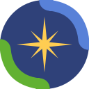

In recent months, the Clojure toolkit for data and science has been maturing. Thus, in 2025, Scicloj can finally shift more resources into making it accessible and well-known.

SciNoj Light is one of the first steps in that direction.

:calendar: [Event](https://clojureverse.org/t/scinoj-light-1st-conference/) (also available at the [Clojure Calendar Feed](https://clojureverse.org/t/the-clojure-events-calendar-feed-turns-2/))

## What is it
SciNoj Light is an online conference where Clojurians will share their short-term data analysis stories.

## Goals
* Encourage Clojurians to create small-but-complete usage stories of [Noj](https://scicloj.github.io/noj) and related libraries. Help them in the process.
* Focus on small stories and make it easy to contribute a topic.
* Explore our online conferencing practices in preparation for bigger "SciNoj" conferences where more established projects will be presented.
* Offer a [cynosure](https://www.merriam-webster.com/dictionary/cynosure) for anybody who wishes to explore data with Clojure.

## Timeline
* Jan 20 - start discussing your initial ideas with the organizers
* Feb 15 - Call For Proposals opens
* Mar 15 - Call For Proposals closes - submit proposals (data analysis notebook drafts)
* Apr 1 - talks are selected
* May 16-17 - conference 
* TBD - a possible additional weekend with extra talks

## Chat
All communication in preparation and during the conference will take place at the [Clojurians Zulip chat](https://scicloj.github.io/docs/community/chat/), specifically in the [#**scinoj-light-1**](https://clojurians.zulipchat.com/#narrow/channel/479601-scinoj-light-1) channel.

## Participating
Participating is online and free.

## Presenting
* You may submit a topic as a team of 1 to 3 people. 
* At least one of the presenters has to know Clojure (or have the curiosity and capacity to learn). Other team members can contribute other parts of the story (e.g., domain knowledge and motivation).
* Pre-recorded talks are encouraged. The Q&A will be live.
* Proposals will include a data analysis notebook draft at [Clojure-data-tutorials](https://scicloj.github.io/clojure-data-tutorials/), the [Noj book](https://scicloj.github.io/noj/), or related spaces.
* The notebooks will be completed before the conference.
* It is recommended that proposals be worked on as projects on the [Open Source Mentoring program](https://scicloj.github.io/docs/community/groups/open-source-mentoring).
* It is recommended to discuss your initial ideas with us as early as possible, and verify they make sense.
* If you are looking for ideas, let us chat. We may connect you with somebody to join on their project. 
* All topics will be specific use cases of data analysis. You may also discuss tools, ideas, and methods but demonstrate them through use cases.
* The projects are not expected to be highly sophisticated but should be presented clearly. They should be reasonable projects that a Clojurian with an open mind can begin and finish in 3 months, working at least 6 hours a week, as a rule of thumb.
* The methods do not have to be sophisticated. Data visualization, statistics, math, and machine learning are encouraged but not required.
* If you have any thoughts or questions, [let us talk](https://scicloj.github.io/docs/community/contact/).

## The SciNoj conference series
More SciNoj conferences are expected in the near future. Some of the future topics we are considering are (1) the uses of Clojure in teaching, (2) Clojure communities, and (3) Clojure in Science.

